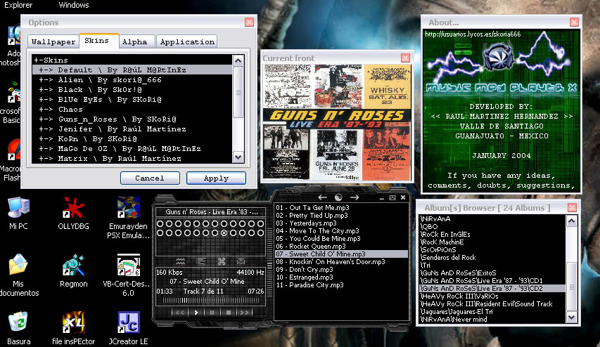



## Music Mp3 Player X

### Description

Music Mp3 Player X, search, order and play through albums mp3, wma,

wav files and show your cover front.

Album Browser, Cover Front Browser, Skins, Languages, Support Alpha

mode, List reproduction, position control, volume control, Intro,

Mute, Repeat, Randomize in Whole Albums or current album functions

and more... And please vote, I worked on it for a long time and

I realy wanna know if you like it - to see if there's any reason to

keep publishing it...
 
### More Info
 

             |
---                |---
**Submitted On**   |2004-04-15 21:52:48
**By**             |[R@úL M@RtInEz](https://github.com/Planet-Source-Code/PSCIndex/blob/master/ByAuthor/r-l-m-rtinez.md)
**Level**          |Advanced
**User Rating**    |5.0 (15 globes from 3 users)
**Compatibility**  |VB 5\.0, VB 6\.0
**Category**       |[Sound/MP3](https://github.com/Planet-Source-Code/PSCIndex/blob/master/ByCategory/sound-mp3__1-45.md)
**World**          |[Visual Basic](https://github.com/Planet-Source-Code/PSCIndex/blob/master/ByWorld/visual-basic.md)
**Archive File**   |[Music\_Mp3\_1734124162004\.zip](https://github.com/Planet-Source-Code/r-l-m-rtinez-music-mp3-player-x__1-53195/archive/master.zip)

